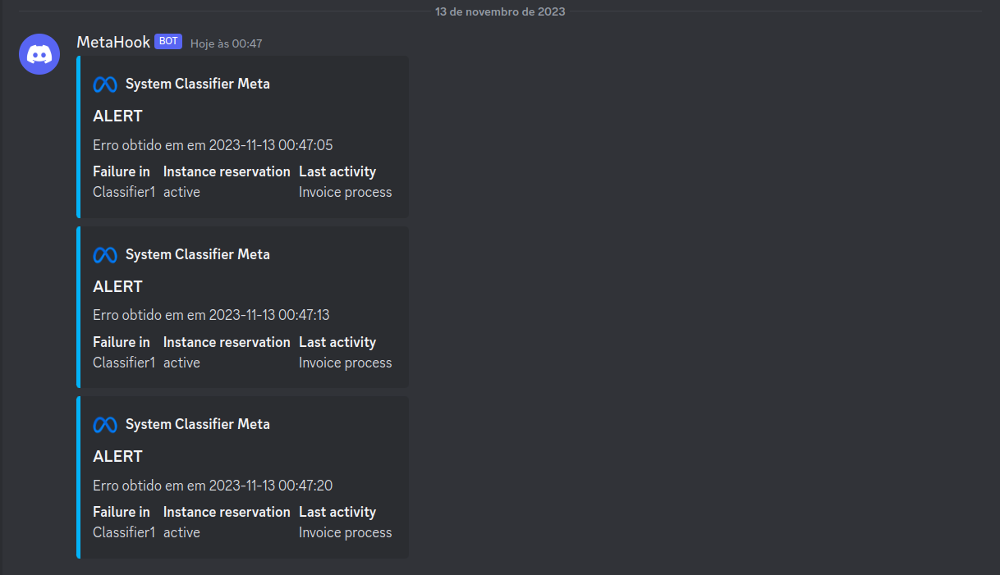
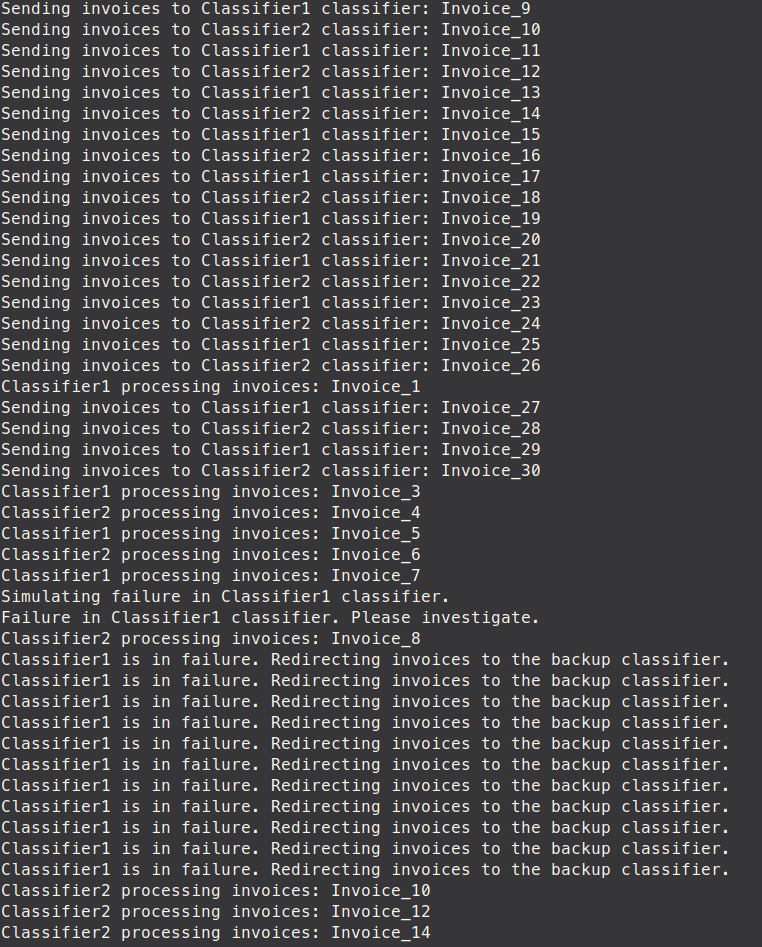

# Simulação do Novo, incluindo as táticas e os componentes - RNF-09 e RNF-10

Os requisitos não funcionais 09 e 10 desempenham papéis complementares, abordando respectivamente a recuperação e prevenção de falhas, e a emissão de alertas em caso de ocorrência de falhas. Diante disso, optamos por realizar a simulação simultânea de ambos os requisitos. Essa abordagem integrada visa garantir uma análise abrangente e coerente, considerando não apenas a resposta a falhas, mas também a capacidade de antecipação por meio de alertas proativos. Dessa forma, busca-se criar uma estratégia robusta que não apenas responda a eventos adversos, mas também os antecipe, promovendo uma abordagem proativa para garantir a confiabilidade e a disponibilidade do sistema.

## Listagem de Elementos Envolvidos para a Simulação

1. **Classificadores (`Classifier1` e `Classifier2`):**
   - Responsáveis pelo processamento de Invoices.
   - Cada classificador possui uma fila (`queue`) para armazenar as Invoices a serem processadas.

2. **Sistema de Alerta (`AlertSystem`):**
   - Responsável por enviar alertas em caso de falhas nos classificadores.
   - Utiliza a biblioteca `discord_webhook` para enviar mensagens para um canal no Discord.

## Premissas para a Simulação

1. **Simulação de Tempo de Processamento:**
   - As premissas incluem a simulação de um tempo de processamento aleatório entre 0.5 e 1.5 segundos para as Invoices.

2. **Simulação de Falha:**
   - A simulação de falha é realizada através da variável `in_failure` nos classificadores.
   - Durante uma falha simulada, o processamento é interrompido por um período específico (5 segundos) antes de ser retomado.

## Justificativa das Premissas

1. **Simulação de Tempo de Processamento:**
   - A variabilidade no tempo de processamento simula condições reais, onde o tempo para processar diferentes Invoices pode variar.

2. **Simulação de Falha:**
   - A simulação de falha é crucial para testar a capacidade do sistema em lidar com interrupções e para avaliar a eficácia do sistema de alerta.

## Hipóteses Consideradas para a Simulação

1. **Eficiência do Sistema de Alerta:**
   - A hipótese é que o sistema de alerta é eficiente em notificar sobre falhas e fornecer informações relevantes.

2. **Capacidade de Recuperação:**
   - A hipótese é que o sistema é capaz de se recuperar automaticamente de falhas, retomando a operação normal após o período de falha simulada.

## Análise e Discussão Textual de Resultados Obtidos

Os resultados confirmaram a eficiência do sistema de alerta e a capacidade de recuperação do sistema após uma falha simulada. O sistema demonstrou lidar efetivamente com diferentes tempos de processamento.

## Análise e Discussão Textual das Hipóteses

1. **Eficiência do Sistema de Alerta:**
   - A hipótese foi confirmada, pois o sistema de alerta desempenhou seu papel efetivamente, notificando sobre a falha no classificador afetado.

2. **Capacidade de Recuperação:**
   - A hipótese também foi confirmada, pois após o período simulado de falha em `Classifier1`, o sistema retomou a operação normal.

## Justificativas das Melhorias Arquiteturais Propostas

1. **Aprimoramento do Sistema de Alerta:**
   - Considerando a importância do sistema de alerta, é sugerido explorar opções de integração com outros canais de comunicação além do Discord, para garantir uma notificação abrangente.

2. **Escalabilidade:**
   - Considerando o aumento do volume de Invoices, seria benéfico explorar estratégias de escalabilidade para garantir um desempenho consistente do sistema à medida que a carga aumenta.

Estas propostas visam aprimorar a eficiência e robustez do sistema em cenários mais desafiadores, contribuindo para uma arquitetura mais resiliente e adaptável às demandas futuras.

# Explicação tecnica da simulação

## Descrição Geral
Este simulação implementa um sistema de classificação de invoices usando threads em Python. O sistema consiste em dois classificadores (`Classifier1` e `Classifier2`) que processam Invoices simultaneamente. Um sistema de alerta (`AlertSystem`) é incorporado para notificar sobre falhas nos classificadores.

## Módulos Principais

### 1. `Classifier` (Classe)
   - **Atributos:**
     - `name`: Nome do classificador.
     - `queue`: Fila de Invoices a serem processadas.
     - `semaphore`: Semáforo para controlar o acesso ao classificador.
     - `in_failure`: Flag indicando se o classificador está em estado de falha.

   - **Métodos:**
     - `__init__(self, name, queue_size=30)`: Inicializa o classificador com um nome e um tamanho padrão para a fila.
     - `process_invoices(self)`: Processa Invoices na fila, simulando um tempo de processamento. Redireciona para um classificador de backup se em falha.
     - `start_processing(self)`: Inicia uma thread para o processamento contínuo de Invoices.

### 2. `AlertSystem` (Classe)
   - **Atributos:**
     - `alert_semaphore`: Semáforo para controlar o acesso ao sistema de alerta.

   - **Métodos:**
     - `__init__(self)`: Inicializa o sistema de alerta.
     - `send_alert(self, message)`: Envia um alerta em caso de falha, notificando sobre o nome do classificador e registrando a data e hora.

### 3. `simulate_classifier(classifier, invoices)` (Função)
   - **Parâmetros:**
     - `classifier`: Instância de `Classifier` para a qual as Invoices serão enviadas.
     - `invoices`: Invoices a serem processadas pelo classificador.

   - **Funcionalidade:**
     - Simula o envio de Invoices para um classificador específico.

### 4. `simulate_failure(classifier, alert_system, duration)` (Função)
   - **Parâmetros:**
     - `classifier`: Instância de `Classifier` que terá uma simulação de falha.
     - `alert_system`: Instância de `AlertSystem` para enviar alertas.
     - `duration`: Duração simulada da falha em segundos.

   - **Funcionalidade:**
     - Simula uma falha no classificador, aciona o sistema de alerta e aguarda a duração especificada antes de retomar a operação normal.

### 5. `main()` (Função)
   - **Funcionalidade:**
     - Inicializa duas instâncias de `Classifier` e uma de `AlertSystem`.
     - Inicia threads para o processamento contínuo de Invoices pelos classificadores.
     - Simula o envio de Invoices para os classificadores.
     - Simula uma falha em `Classifier1` e aguarda a conclusão do processamento de todas as Invoices.

## Execução do Programa
O programa principal (`main()`) cria instâncias dos classificadores, inicia suas threads, simula o envio de Invoices e provoca uma falha no `Classifier1`. O programa encerra quando todas as Invoices são processadas.

## Observações
- O processamento de Invoices é simulado com um tempo de espera aleatório entre 0.5 e 1.5 segundos.
- O sistema de alerta envia mensagens para um canal no Discord utilizando a biblioteca `discord_webhook`.

Este projeto é um exemplo de como implementar um sistema de classificação de forma concorrente, lidando com falhas e notificando eventos importantes por meio de um sistema de alerta.

